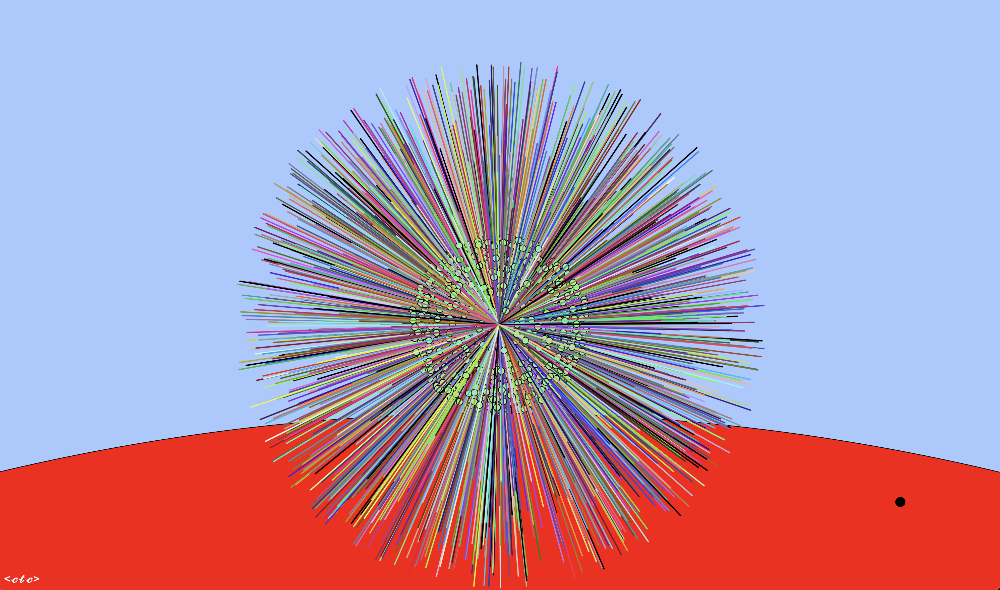
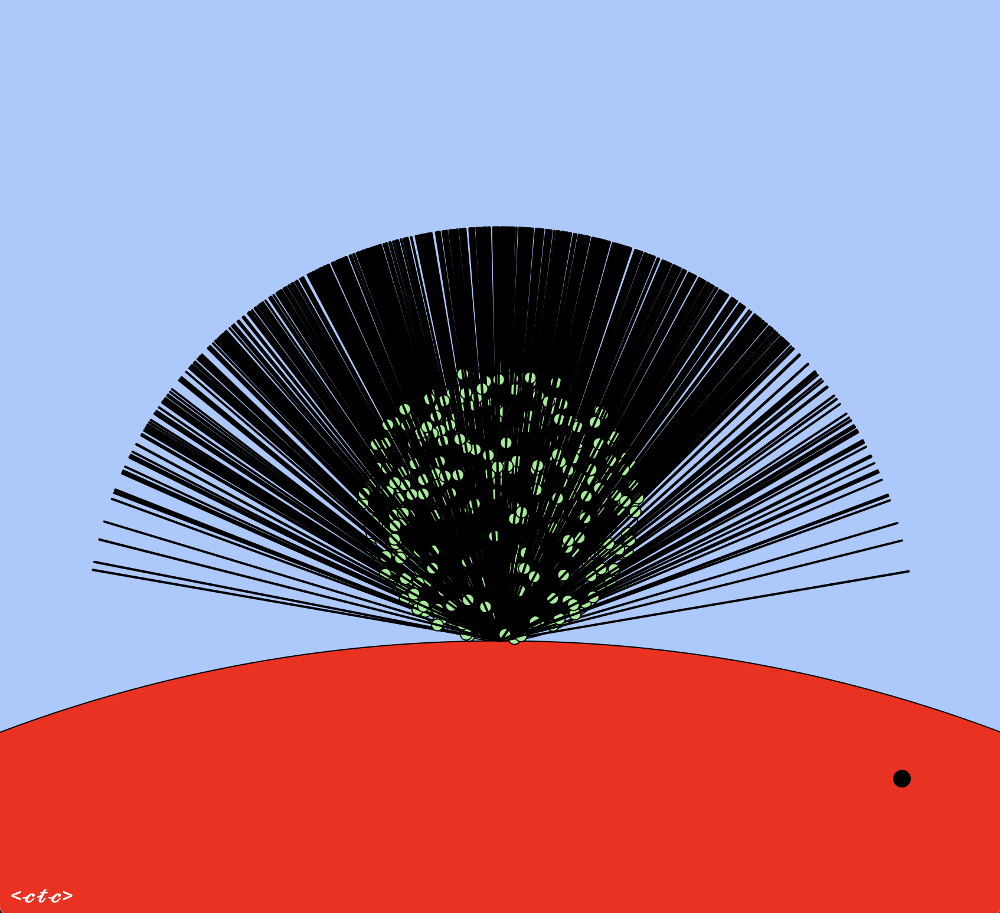
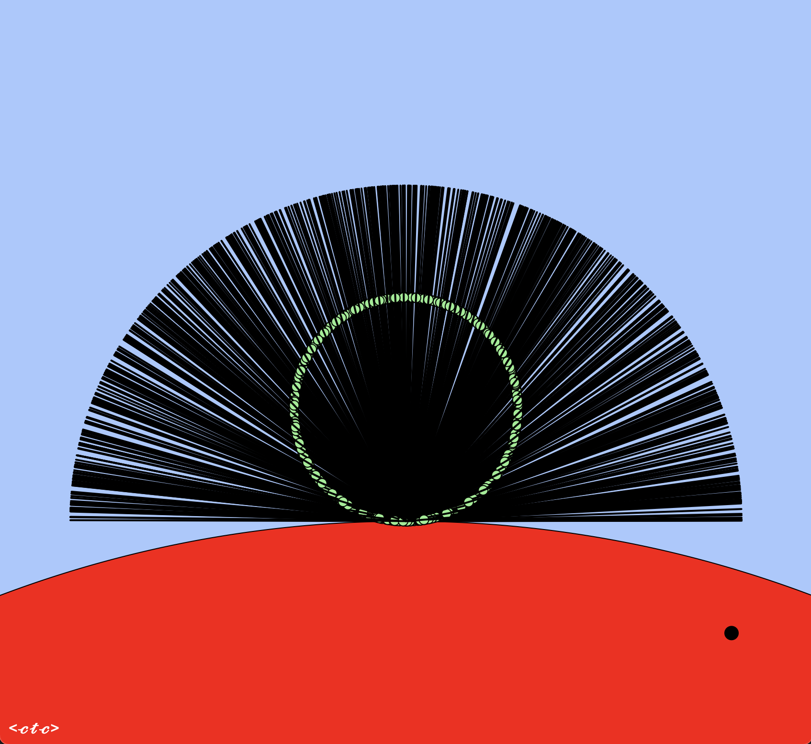

# Visualization of 2d Lambertian reflection vectors
...as described in Peter Shirley's [_Ray Tracing in One Weekend_](https://raytracing.github.io/books/RayTracingInOneWeekend.html)

Cameron Christensen - Fall 2021

  

Lambertian almost          |  Lambertian proper
:-------------------------:|:-------------------------:
  |  

## Algorithms

- One method, called "almost Lambertians," creates vectors from random points in a unit circle. This is the default so you'll be more impressed when you see the other method.  
- Another method projects these random points to the edge of the circle and creates vectors from these. You can see the distribution of vectors is more even across the hemisphere.
- Finally, the hemisphere was added, but its weaknesses are unclear, especially here in 2d.

## Shortcuts

'l'/'L' to cycle between methods  
'c' to toggle source  
'r' refresh  
'+'/'-' inc/dec lines  
'a' artistic colors  
'g' toggle gui  

## Stuff
<self-deprecation>
Maybe somebody has done this already, and likely better. It's probably the first comment I'll get on it.  

I just wanted to better understand and compare these algorithms for Lambertian reflection.  
This is my first use of jquery, svg, etc, and super hacky at that.  

I just wrote quick Vec and Ray classes because I was too lazy to cut and paste anything, much less find a module to import, then learn how to use it--I just wanted to see some lines, remember? Plus xxXxXx has traumitized me so much that I now avoid ever wanting to use anyone else's libraries ever again.  

Yes, I'm going to share this, and I don't want to be judged on this crap code, but it's still cool to press a couple keys to see the differences between these methods more clearly illustrated.  

</self-deprecation>

**WARNING:** ...and for hack sakes, don't look at this and try to actually create a reflection vector in real life.

## TODO

More like "other things I'm curious to examine offline." By "offline" I mean outside the place where they'll be used, e.g., a ray tracer.

- [ ] other kinds of reflections, like smoother operators and psychiatric
- [ ] use random theta with hemi-circle to emulate uniform selection of theta on hemisphere
- [ ] 3d
- [ ] refractions

